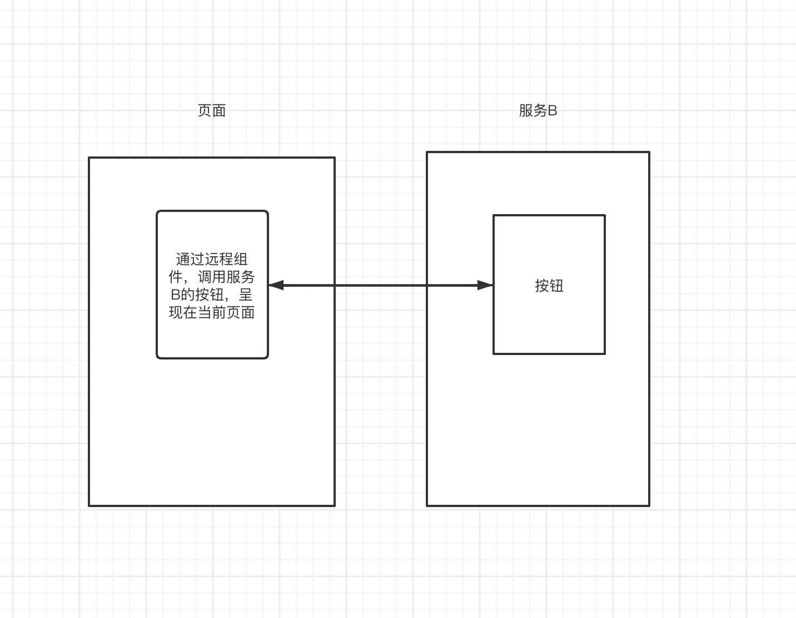
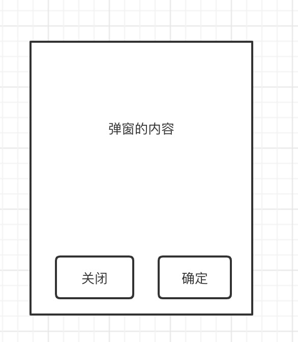

# 对远程组件进一步的设计和思考
远程组件，是 `Genesis` 提出的一个概念，它是指通过接口，调用一个另一个服务的组件，它可以是一个按钮、一个模块或者一个页面。    

## 嵌入式调用
除了嵌入图片、视频之类的，在日常开发，嵌入调用最多的还是 `iframe`。    
而远程组件，可以让你在服务端、客户端都能无缝的嵌入另外一个服务的页面。    
如下图：

它的使用方式是这样子
```vue
<template>
    <remote-view :id="1000" @myEvent="onMyEvent" :fetch="fetch" />
</template>
<script>
export default {
    methods: {
        fetch () {
            // 调用其它服务的组件
            const res = await axios.get('/api/ssr-服务名称/render?url=/demo');
            if (res.status === 200) {
                return res.data;
            }
            return null
        },
        onMyEvent () {
            // 处理远程组件的事件
        }
    }
}
</script>
```

## API 形式调用
假设你有这样的一个弹框    
如下图：    
    
这个弹窗只有两种状态，要么取消、要么确定，操作完成。那么它可以设计成类似于下面的 API
```ts
const res = await Popup.show(options);
switch (res) {
    case 'cancel':
        // 用户点击[取消]的时候做些什么
        break;
    case 'confirm':
        // 用户点击[确定]的时候做些什么
        break;
}
```
看到上面，是不是很像我们的接口调用的方式，只不过这次调的不是接口，而是一个 UI 组件。    
    
而远程组件，就可以为我们将这样的 UI 组件，抽象出一个真正类似于接口的组件，所以它的调用可能是下面这样子的
```ts
const res = await remote.get('/api/ssr-服务名称/render?url=/popup');
switch (res) {
    case 'cancel':
        // 用户点击[取消]的时候做些什么
        break;
    case 'confirm':
        // 用户点击[确定]的时候做些什么
        break;
}
```

## 微服务
其实 `Genesis` 最核心的能力在于它可以真正的实现前端版本的微服务架构，独立部署、独立运行、服务和服务之间的调用，通过 API 的形式通信，它将大大的提升了前端的创造力。而微前端的概念，只是它顺便支持的功能而已。

为什么需要它？    
随着前端 SPA 应用的发展，项目越来越大，我们需要极其灵活的服务拆分方案，利用分治的思想，将一个大的应用，不断的拆解成一个小的应用，通过接口的形式，可以让我们的应用拆分做得更加的灵活。

## 最后
`Genesis` 已经推广了这么多次，但是丝毫没有引起社区的关注，其实我倒是很乐意这个概念、这个设计的思想普及到，能诞生出更多成熟的微服务架构的解决方案。
个人的写作能力有点差，如有疑问，欢迎在 [issues](https://github.com/fmfe/genesis/issues) 讨论。    
如果对本项目感兴趣的话，欢迎 Star [🔥基于 Vue SSR 的微前端、微服务、轻量级的解决方案🔥](https://github.com/fmfe/genesis)