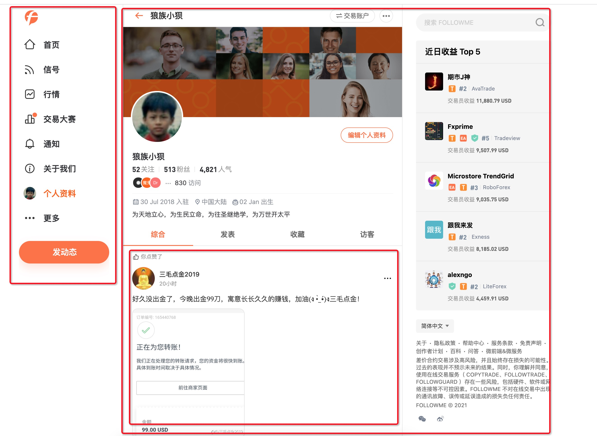
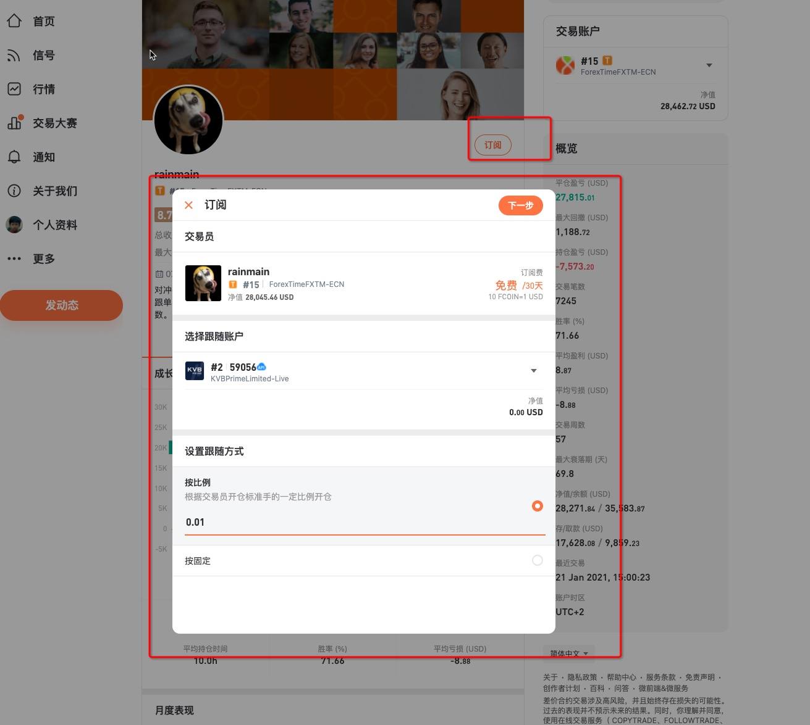
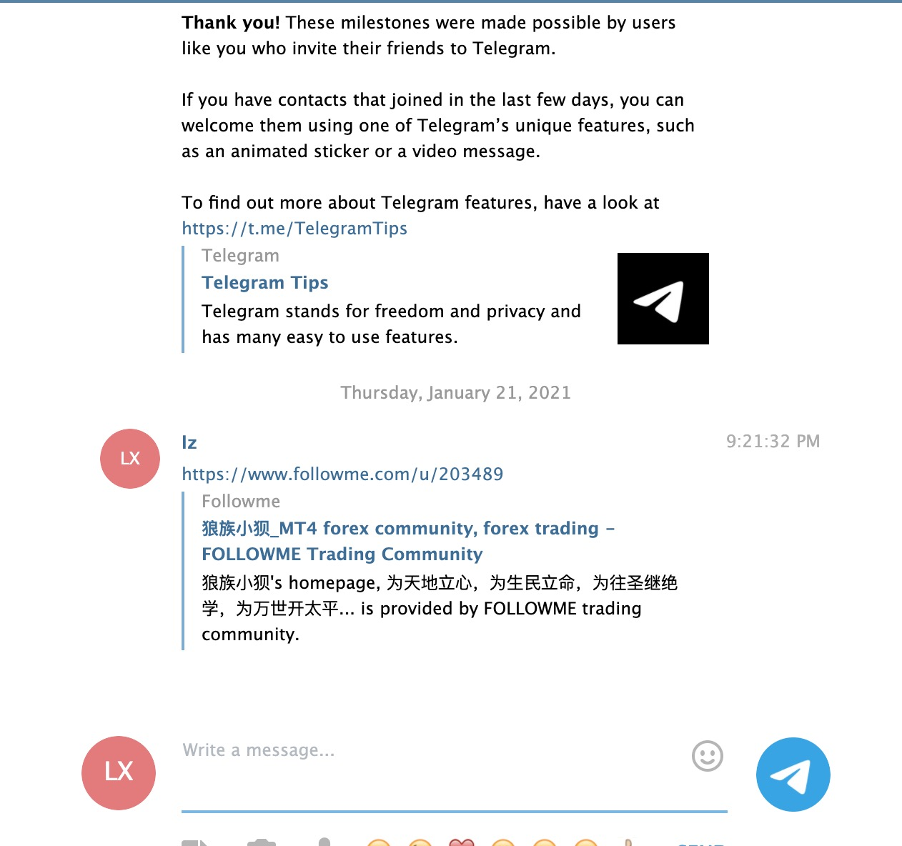
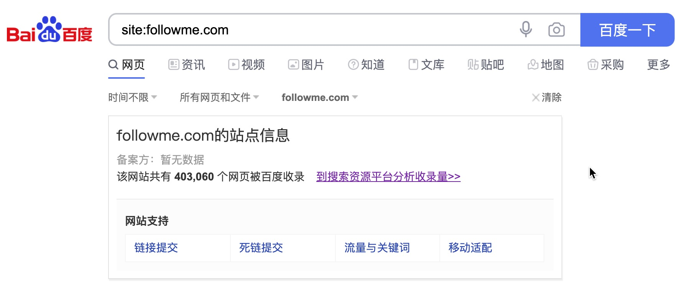

# 2021基于Vue SSR的微服务&微前端的解决方案Genesis的一些最佳实践

2020年过去了，[FOLLOWME](https://www.followme.com)网站也大概完成了50%以上的业务模块的重构，`如果不是我孤陋寡闻`，应该是Vue SSR 微服务领域应用最大规模的网站。同时[Genesis](https://github.com/fmfe/genesis)应该也是在Vue SSR 微服务领域第一个成熟开源的解决方案。

## FOLLOWME
它是一个业务模块非常多的网站，涵盖了feed流、个人展示页、信号、钱包、品牌专页、设置、钱包、账户管理、账户链接、搜索、品种详情、通知等等模块，以及要支持国际化、SEO、自定义meta信息。我们既要做到首屏服务端渲染，又要做到在客户端像应用一样切换页面，寻遍了社区，都没有找到合适的解决方案，最终诞生了[Genesis](https://github.com/fmfe/genesis)。

### 一个页面，由多个微服务聚合而成


### 远程组件调用


### 自定义Meta


### 搜索引擎收录增长

## Genesis
它是一个Vue SSR的渲染库，并非是一个完整的框架，它的价值完全取决于使用者的功力。它也不是为了取代Nuxt.js而诞生，但是你可以使用它来创建一个像Nuxt.js一样的框架。它既可以杀鸡（`CSR`），也可以杀牛（`SSR`），更可以组织千军万马（`微服务架构`）

### 渲染器
在[Genesis](https://github.com/fmfe/genesis)中，不管在开发环境，还是生产环境，都需要获得渲染器（`renderer`），有了它，你才能结合Express、Koa、Egg、Nest等服务端框架使用。
```ts
import { SSR } from '@fmfe/genesis-core';

/**
 * 创建一个ssr实例
 */
const ssr = new SSR();

/**
 * 创建一个渲染器
 */
const renderer = ssr.createRenderer();

/**
 * 输出html
 */
renderer
    .renderHtml({
        url: '/path'
    })
    .then((res) => {
        console.log(res.data);
    });

```
通过上面代码的例子，你会发现使用[Genesis](https://github.com/fmfe/genesis)去创建一个SSR的应用程序，将会变得异常简单，你只需要在对应的服务端框架中在请求进来时，调用渲染器的方法，返回输出的内容即可，[完整的例子还是要看这里](https://fmfe.github.io/genesis-docs/guide/)

### 远程组件
不管是在客户端，还是在服务端，如果我们需要嵌套其它服务的组件，都需要通过远程组件来获得其它服务的初始化信息
```vue
<template>
    <remote-view :fetch="fetch" />
</template>
<script>
import axios from 'axios';

export default {
    methods: {
        async fetch () {
            // 调用其它服务的组件
            const res = await axios.get('其它服务的提供的接口');
            if (res.status === 200) {
                return res.data;
            }
            return null
        }
    }
}
</script>

```
那么其它的服务，就可以将SSR应用输出一个json，来提供给其它的服务使用，只要把下面的`res.data`提供给上面例子的`res.data`即可实现页面的嵌套，完整的例子[点击这里](https://fmfe.github.io/genesis-docs/remote/)
```ts
renderer
    .renderJson({
        url: '/path'
    })
    .then((res) => {
        console.log(res.data);
    });
```

## 使用vue-meta来管理页面元数据
我们要管理页面的标题、SEO相关描述等，通过`vue-meta`可以很好的满足我们的需求，它可以像下面非常简单的实现
```vue
<template>
    <div class="app">
        ....
    </div>
</template>
<script lang="ts">
import Vue from 'vue';

export default Vue.extend({
    name: 'app',
    metaInfo() {
        return {
            title: '标题'
        };
    }
});
</script>
```