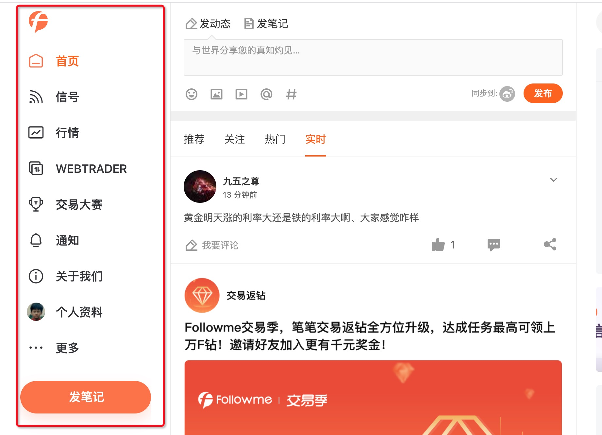
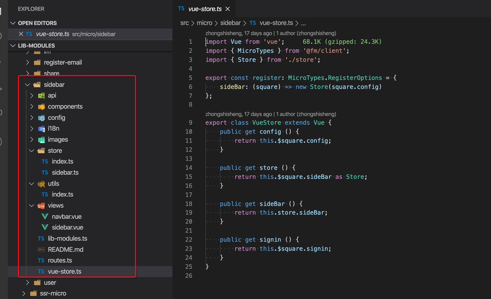
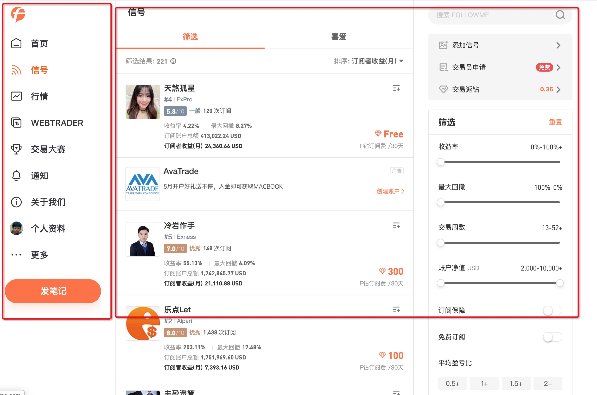

# 基于 Vue SSR 的微架构在 FOLLOWME5.0 实践
2020年5月22日[FOLLOWME5.0](https://www.followme.com/c/21009745?source=genesis)的第一个版本终于上线了，这也是公司内部基于 `Genesis` 上线的第二个项目。首页是老项目经历了最原始的那种 Vue SSR，后来在年初的时候，迁移到了 Nuxt.js 下，再到现在迁移到了 `Genesis`，可谓是一波三折。

## 首次实践

在2019年的上半年，我们在和 APP 混合开发的项目中，首次实践了模块化，它拥有了独立的 API、路由、状态和页面，并且是按需进行初始化的，但是它并不是完美的，它是基于路由的微模块，并且状态也是按需注入到全局的状态中的管理
## 无路由微模块
2019年的8月份，我开始介入到 web 端首页的开发，首先面对的就是基于 Vuex 的状态管理，所有的状态全部注入到全局的状态，交集到一起，随着业务的迭代，已经分不清楚哪些是需要的，哪些是可以被删除的，随着业务规模的膨胀，越来越难以维护。为了保证无入侵性，基于[Tms.js](https://www.npmjs.com/package/tms.js)抽象出来了一个支持微模块的状态库，这时候我们的微模块拥有了独立的 API、状态和页面。


我们5.0左导航就被抽离成一个独立运行的微模块，一个微模块由多个组件组合而成，它有自己内部状态管理。

## 大跃进
在2019年年底的时候，得知我们要升级5.0的版本，网站也将会大幅度的重构，在基于已有的微模块开发理念下，我们希望能够更近一步，解决一些以往项目架构的弊端。    

5.0之前，我们有一个公共的导航栏，不管是 CSR、还是 SSR 的项目都需要它，每次导航栏发生变更之后，都需要重新打包十几个项目发布，这极大的消耗了我们的身心体力，我希望能做到一个页面可以由不同的 SSR 服务聚合而成，通过 API 的形式提供给另外一个服务使用。

这个大胆的想法诞生后，我们深入的研究了一下 Nuxt.js，期望它可以做到我们的需求，经过一番调研后，确认无法满足我的需求后，最终还是选择了造轮子。

## Genesis
参考了一些社区 SSR 框架的实现，基本上都是封装好的框架，灵活性较低，而我们期望它是一个简单的 SSR 库，当成一个工具函数来使用，以便于能够支撑多实例运行。

在这里的理念下， 它没有像 Nuxt.js `nuxt.config.js` 这样直接读取一个配置开始运行，给你集成了各种各样的功能，它仅仅一个基础到不能再基础的渲染工具函数

```typescript
import { SSR } from '@fmfe/genesis-core';

const ssr = new SSR();

const renderer = ssr.createRenderer();

renderer.render({ url: '/' });

```
当然了，在实际的业务中，我们还需要创建一个 HTTP 服务将我们的内容返回给用户。
    
    
如果要做到微服务，并且能被不同的服务之间调用，首先就需要服务的自身具备将渲染结果输出 `JSON` 的能力，然后第三方服务读取渲染结果，输出到 HTML 中
```typescript
renderer.render({ url: '/', mode: 'ssr-json' });
```
我们巧妙的使用了 Vue 的 `Renderer` 选项 [template](https://ssr.vuejs.org/zh/api/#template)，传入一个函数，执行完成后返回了一个 JSON 的渲染结果
```typescript
const template: any = async (
    strHtml: string,
    ctx: Genesis.RenderContext
): Promise<Genesis.RenderData> => {
    const html = strHtml.replace(
        /^(<[A-z]([A-z]|[0-9])+)/,
        `$1 ${this._createRootNodeAttr(ctx)}`
    );
    const vueCtx: any = ctx;
    const resource = vueCtx.getPreloadFiles().map(
        (item): Genesis.RenderContextResource => {
            return {
                file: `${this.ssr.publicPath}${item.file}`,
                extension: item.extension
            };
        }
    );
    const { data } = ctx;
    if (html === '<!---->') {
        data.html += `<div ${this._createRootNodeAttr(ctx)}></div>`;
    } else {
        data.html += html;
    }
    data.script += vueCtx.renderScripts();
    data.style += vueCtx.renderStyles();
    data.resource = [...data.resource, ...resource];
    (ctx as any)._subs.forEach((fn: Function) => fn(ctx));
    (ctx as any)._subs = [];
    return ctx.data;
};
```

## 远程组件
考虑到不是所有的项目，都需要远程调用，所以远程调用组件，我们是以独立的包提供的。在拿到 SSR JSON 的渲染结果后，远程组件将会帮我们负责嵌入到该服务的页面中去。
```vue
<template>
    <remote-view :fetch="fetch" />
</template>
```
`fetch` 是一个异步的回调函数，你可以通过使用 axios 库来发送请求将 SSR 渲染的结果返回给 `remote-view` 组件。
```typescript
renderer.render({ url: '/', mode: 'ssr-json' }).then((r) => {
    // 编写一个接口， 将 r.data 提供给 remote-view 组件访问
});
```

## 5.0的服务拆分

根据 UI 的呈现效果，我们将左导航和内容区拆分成不同的服务，其中内容区因为开发团队的不同、业务的不同，又拆分成不同的服务。
第一个版本我们拆分了左导航的 `node-ssr-general` 服务，首页和通知的 `node-ssr-home` 服务，以及信号的 `node-ssr-signal` 服务，每一个服务都是独立部署、独立开发、由不同的人进行维护，只是最终由 `node-ssr-general` 服务进行聚合。

未来我们的产品还将会进一步迭代，越来越多的服务都将会被集成进去这个大应用中。

## 内网域名
最初的 SSR 服务，尝试过使用 RPC 和 HTTP 获取接口数据进行渲染，后面经过权衡后，在5.0我们统一采用了在服务端配置 HOST 的方式，配置一个内网的域名，提供给 SSR 服务通过 HTTP 请求来获取数据

## 服务的加载策略
为了首屏可以更快的呈现给用户，所以在服务端远程组件走的是 SSR 的渲染，在客户端路由切换的时候，走 CSR 渲染，所以在`首页`切换到`信号`栏目时，会有一些加载过程明显的白屏。

后续可以通过 Service Worker 对所有服务的静态资源和 CSR 渲染时的 HTML 进行预加载，减少加载该服务内容时，出现白屏的几率

## 关于微前端
从理论上，`Genesis` 也可以同时做到 React 的支持，输出同样标准的 JSON 渲染结果、同样标准的应用创建和销毁逻辑。只是目前我们团队都是以 Vue 为主，所以这方面还需要团队有时间才能支持。

## 传送们
[](https://www.followme.com/signal/?source=genesis)    
- [FOLLOWME5.0](https://www.followme.com/c/21009745?source=genesis) 新版的策略体验   
- [Genesis](https://github.com/fmfe/genesis) Github   
- [Genesis](https://fmfe.github.io/genesis-docs/) 文档   
- [文章来源地址](https://fmfe.github.io/genesis-docs/blog/followme5.0.html)