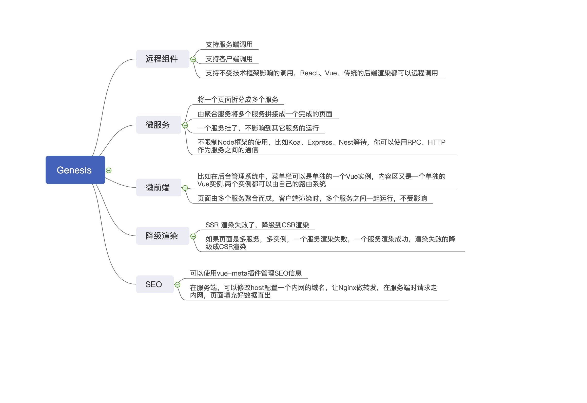

# 介绍

## 项目起源
2019年年底的时候，得知公司要推出一个 [Followme5.0](https://www.followme.com?source=genesis) 的版本，到时候将会大幅度的重构整个web端的产品，所以本项目也开始应运而生。当时网站首页采用的是 [Nuxt](https://github.com/nuxt/nuxt.js) 作为SSR的框架，但是它无法满足我们的一些需求，也曾尝试过编写 [Nuxt](https://github.com/nuxt/nuxt.js) 插件来实现我们的需求，但是最终无法实现，只能另起炉灶了。

## 为什么没有继续使用Nuxt?
[Followme](https://www.followme.com?source=genesis)是一个极其复杂的网站，我们的技术栈包含了 SSR 和 CSR，在更新公共组件的时候，经常需要同时更新十几个项目，而前端的项目编译又特别慢，就导致哪怕是一个文案的改动，也需要发布大半天。而 [Nuxt](https://github.com/nuxt/nuxt.js) 的架构形态都是单应用，无法在一个页面上同时支持多个应用实例，以及做到 SSR 微服务化。在微服务理念的构思下，我们开始思考如何重新设计我们需要的架构。

## 我们的需求

我们需要`远程组件`、`微服务`、`微前端`、`降级渲染`、`SEO`，经过了一些技术的调研，包括了 [Nuxt](https://github.com/nuxt/nuxt.js) ，最终选择了自己造轮子。

## 架构
|核心库|版本号|下载量|说明|
|:-|:-:|:-|:-|
|[@fmfe/genesis-core](https://fmfe.github.io/genesis-docs/core/)| ||提供基础的插件机制、SSR渲染逻辑、程序配置|
|[@fmfe/genesis-compiler](https://fmfe.github.io/genesis-docs/compiler/)| ||仅限开发环境使用，负责编译程序以及在开发时编译，处理webpack的核心逻辑|
|[@fmfe/genesis-app](https://fmfe.github.io/genesis-docs/app/)| ||快速创建应用，包装了 vue-router ，在微前端应用时支持多个 Router实例时特别有用|
|[@fmfe/genesis-remote](https://fmfe.github.io/genesis-docs/remote/)| ||远程组件，实现微前端的核心依赖|
|[@fmfe/genesis-lint](https://www.npmjs.com/package/@fmfe/genesis-lint)| ||一个代码规范的集成，包含了eslint和stylelint|

[Nuxt](https://github.com/nuxt/nuxt.js) 是将 webpack、babel 等开发时用到的依赖，都整合到一个包里，所以就造成了发布生产环境时，需要安装的依赖就特别的多，导致了 docker 构建出来的镜像就特别的大。所以在设计 `Genesis` 时，将生产和开发时用到的功能，分别拆分成 `@fmfe/genesis-core` 和 `@fmfe/genesis-compiler`，这样在生产环境时，只需要安装 `@fmfe/genesis-core` 即可，对比 [Nuxt](https://github.com/nuxt/nuxt.js) 将会大大的减少了 docker 镜像的体积

### 小型项目
如果你的项目比较简单，不需要考虑`微服务`、`微前端`，只需要使用 `@fmfe/genesis-core` 和 `@fmfe/genesis-compiler` 即可。

### 大型项目
如果你的项目比较复杂的情况下，需要拓展到`微服务`、`微前端`，才需要使用 `@fmfe/genesis-app` 和 `@fmfe/genesis-remote`。

### 代码风格
`@fmfe/genesis-lint` 是基于一些开源的规范的整合，你完全可以使用其它的第三方 lint 插件。

## 定位
`Genesis` 是一个轻量级的 Vue SSR 库，它不是框架，它只是提供了最底层 SSR 相关的能力，比如你想做微前端、微服务、或者生成静态的HTML网站、PWA等等，你都需要通过第三方的插件来完成，后续的篇幅将会带你更加深入的学习和了解 `Genesis`。