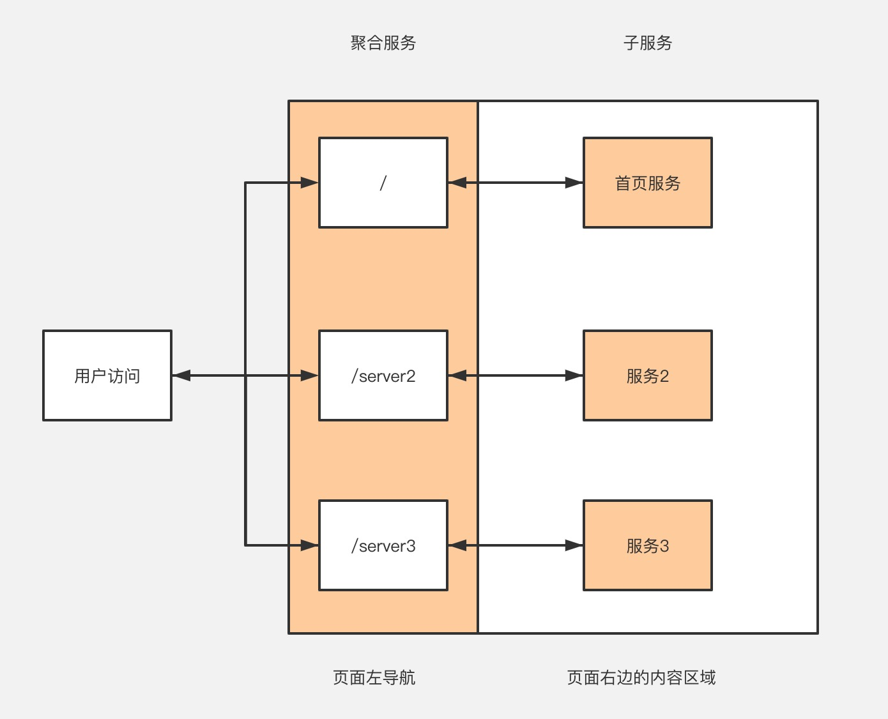

# 微前端&微服务
随着应用规模越来越大，把所有业务模块的功能，全部都打包到一个项目中将会导致打包的速度越来越慢，而且如果多个团队去维护的时候，就很容易出现冲突。所以我们才需要拆分成不同的服务，分解业务模块。下面将会以 [Followme5.0](https://www.followme.com/?source=genesis)布局来带大家实现一个微前端、微服务的架构。

## 架构图

- 从前端布局上看，分为左导航和右边的内容区域，是一个典型的左右布局
- 从服务架构上看，分为聚合服务和子服务，所有的请求都会进入到聚合服务，根据不同的url地址去请求对应的子服务
