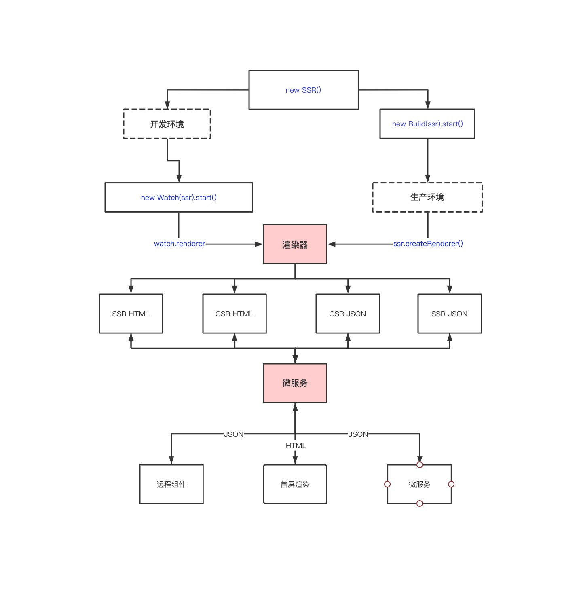

# 渲染器

在 `Genesis` 中，核心的就是渲染器，它提供了最基础渲染能力，有了它，你可以实现微前端、微服务、远程组件、首屏渲染，甚至可以和 React、EJS 等配合使用。

## 它可以和怎样的你协作？
- 如果你是传统的后端渲染的，需要做SEO，但是你希望在部分布局，部分页面引入 Vue，那么 `renderer.renderJson()` 足以，将渲染结果传递给后端渲染的模板引擎中即可。
- 如果你是中后台系统，业务系统全部集中在一个项目，你希望可以按照业务进行服务的拆分，那么 `<remote-view :fetch="fetch" />` 足以
- 如果你是 CSR 渲染的项目，那么 `renderer.renderHtml({ mode: 'csr-html' })` 足以
- 如果你是 SSR 渲染的项目，那么 `renderer.renderHtml({ mode: 'ssr-html' })` 足以

如果你想做微前端、微服务、那么`渲染器` 天生就具备了这样的能力，你可以把它当成一个工具函数使用，你可以通过 HTTP 、 RPC 等等各种协议访问到你的服务，然后使用它进行渲染

## 创建一个渲染器
### 开发环境
```ts
import { SSR } from '@fmfe/genesis-core';
import { Watch } from '@fmfe/genesis-compiler';

const start = async () => {
    const ssr = new SSR();
    const watch = new Watch(ssr);
    await watch.start();
    const renderer = watch.renderer;
    // 拿到渲染器之后，做点什么 ....
};

start();

```
如果你是项目是第一次创建，程序将会自动在项目根目录创建 Vue 基本的模板。
```
.
├── src
│   ├── app.vue           入口的页面
│   ├── entry-client.ts   客户端入口文件
│   ├── entry-server.ts   服务端入口文件
│   └── shims-vue.d.ts    vue文件的TS声明
│ 
└── package.json
```
因为在实际的开发环境中，我们还需要静态资源的文件和热更新，`watch` 对象还提供了对应的中间件使用，如果你使用 `Express` 框架，可以直接使用
```ts
/**
 * 静态资源中间件
 */
app.use(watch.devMiddleware);
/**
 * 热更新的中间件
 */
app.use(watch.hotMiddleware);
```
如果你使用了 Koa，或者其它的框架，就需要在对应框架上包装一层中间件使用。

### 生产环境
开发完成后，需要发布产环境，我们总是需要将代码提前编译好，这样用户访问的时候，就可以立马快速的渲染，所以第一步我们需要先编译代码
```ts
import { SSR } from '@fmfe/genesis-core';
import { Build } from '@fmfe/genesis-compiler';

const start = () => {
    const ssr = new SSR();
    const build = new Build(ssr);
    return build.start();
};

start();

```
::: warning 注意
在这里你需要把环境变量 `NODE_ENV` 设置为 `production`，否则编译出来的是开发模式下的代码，运行时的性能会非常差。
:::
```bash
NODE_ENV=production ts-node index.ts
```
执行上面的编译命令后，我们将会得到一个 `dist` 目录，里面放置了我们编译后的代码。如果你想更改编译输出的地址，或者应用名称，可以[点击这里](/core/#ssr-选项)了解更多
```
.
├── dist
│   ├── ssr-genesis                           应用名称
│   │   ├── client                            客户端资源文件
│   │   |   ├── js                            脚本
│   │   |   ├── css                           样式
│   │   |   ├── images                        图片
│   │   |   ├── medias                        媒体资源
│   │   |   └── fonts                         字体文件
│   │   ├── server                            服务端资源文件
│   │   │   ├── vue-ssr-client-manifest.json  客户端构建清单
│   │   │   └── vue-ssr-server-bundle.json    服务端应用包
│ 
└── package.json

```
代码构建完成后，我们就可以在生产环境中直接创建一个渲染器了。
```ts
import { SSR } from '@fmfe/genesis-core';

const start = async () => {
    const ssr = new SSR();
    const renderer = ssr.createRenderer();
    // 拿到渲染器之后，做点什么 ....
};

start();
```
生产环境，静态资源都是基于内容哈希生成的文件名，所以这里设置静态目录的时候，设置强缓存即可
```ts
app.use(
    renderer.staticPublicPath,
    express.static(renderer.staticDir, {
        immutable: true,
        maxAge: '31536000000'
    })
);
```

## 渲染器的使用
至此，不管是开发环境还是生产环境，我们都已经拿到了渲染器，接下来我们可以使用渲染器去做一些事情了。
### 渲染方法
```ts
renderer.render().then((result) => {
    console.log(result.data);
});
```
在默认的情况下，等同于下面的
```ts
renderer.render({ url: '/', mode: 'ssr-html' }).then((result) => {
    console.log(result.data);
});
```
关于渲染方法的更多选项，[点击这里了解](/core/#renderer-render)
`renderer.render` 方法是渲染器最底层的方法，下面的功能都是基于它来进行封装的。
### 渲染中间件
如果你的业务比较简单，可以直接通过我们的中间件进行快速的开发，它只是一个简单的 `SSR` 中间件。
::: warning 注意
如果 SSR 渲染失败，该中间件不会帮你降级渲染到 CSR
:::
```ts
app.use(renderer.renderMiddleware);
```
### 渲染 HTML
```ts
const result = await renderer.renderHtml();
console.log(result);
```
### 渲染 JSON
```ts
const result = await renderer.renderJson();
console.log(result);
```

### 降级渲染
为了更好的用户体验，在SSR渲染失败的时候，我们期望它可以降级渲染到 CSR 模式，我们可以对渲染的方法包装一层，并且打印出错误信息。甚至可以通过一些监控工具，推送到你的邮箱、短信进行报警。
```ts
const render = (options: RenderOptions = {}) => {
    return renderer.render(options).catch((err: Error) => {
        // 打印渲染失败的错误信息
        console.error(err);
        const mode: RenderMode = options.mode || 'ssr-html';
        return renderer.render({
            ...options,
            mode: mode.indexOf('html') ? 'csr-html' : 'csr-json'
        });
    });
};
const result = await render();
console.log(result.data);
```

### 使用路由
调用渲染函数时，传入要渲染的地址和路由的模式，因为在使用远程组件的时候，我们可能不太希望这个组件使用历史模式渲染，也可能使用 `abstract` 模式渲染，可以最好将它做成动态的参数来控制。
```ts
const result = await render({ url: '/', state: { routerMode: 'history' } });
console.log(result.data);
```
::: warning 注意
[vue-router](https://router.vuejs.org/zh/) 不支持一个页面上创建多个历史模式的路由实例，否则你调用 `router.push()` 方法时，将会创建多个历史记录，为了解决这个问题，请使用 [genesis-app](/app/) 的路由
:::
#### router.ts
新增路由的配置文件，更多了解[请点击这里](https://router.vuejs.org/zh/)
```
npm install vue-router
```
```ts
import Vue from 'vue';
import Router, { RouterMode } from 'vue-router';

Vue.use(Router);

export const createRouter = (mode: RouterMode = 'history') => {
    return new Router({
        mode: mode,
        routes: [
            // 配置你的路由
        ]
    });
};

```
#### entry-server.ts
修改我们的服务端入口文件
```ts
import { RenderContext } from '@fmfe/genesis-core';
import Vue from 'vue';
import App from './app.vue';
import { createRouter } from './router';

export default async (renderContext: RenderContext): Promise<Vue> => {
    // 读取传过来的路由模式
    const mode = renderContext.data.state.routerMode;
    // 创建路由
    const router = await createRouter(mode);
    // 设置渲染的地址
    await router.push(renderContext.data.url);
    // 创建 Vue 实例
    return new Vue({
        // 传入路由对象
        router,
        renderContext,
        render(h) {
            return h(App);
        }
    });
};
```
#### entry-client.ts
修改我们的客户端入口文件
```ts
import { ClientOptions } from '@fmfe/genesis-core';
import Vue from 'vue';
import App from './app.vue';
import { createRouter } from './router';

export default async (clientOptions: ClientOptions): Promise<Vue> => {
    // 读取服务端下发的路由模式
    const mode = clientOptions.state.routerMode;
    // 创建路由
    const router = await createRouter(mode);
    // 设置渲染的地址
    await router.push(clientOptions.url);
    // 创建 Vue 实例
    return new Vue({
        // 传入路由对象
        router,
        clientOptions,
        render(h) {
            return h(App);
        }
    });
};

```
#### app.vue
修改我们的视图文件，以便支持路由渲染
```vue
<template>
    <div class="app">
        <h2>你好世界！</h2>
        <p v-if="show" @click="close" class="text">
            {{ installed ? '在客户端应该安装成功，点击我关闭!' : '未安装' }}
        </p>
        <router-view />
    </div>
</template>
```

## 总结
上述的教程，教你学会了一些基本的渲染器的使用，有了它，你可以和各种服务端框架配合使用了。本教程，这里提供了一个完整的demo，[点击这里](https://github.com/fmfe/genesis-router-demo)了解更多。